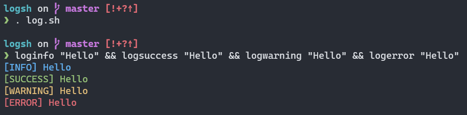

# Logsh 

A minimal POSIX compliant logging library contained in a single Shell script
made to be sourced in every file you want to use the library's functions.



## Getting Started

Download [`log.sh`](log.sh) to whatever location you want to use the library.
So usually right next to the script from where `log.sh` is sourced from.

Alternatively, use [`update-logsh`](update-logsh) to download `log.sh`.
It can be used to download and place `log.sh` to the directory where
`update-logsh` is located at. `update-logsh` also allows
downloading a specific commit reference.

Usually you will end up with many `log.sh` scattered around different places.

## Usage

Source `log.sh` from within scripts where you want to use it with a block like this:

```sh
# Get source dir of script. <https://stackoverflow.com/a/29835459/7391331>.
script_dir=$(CDPATH= cd -- "$(dirname -- "$0")" && pwd)

. "$script_dir/log.sh"
```

Now several functions for logging will be available.

To find more information about the inner workings of `log.sh` or how to
configure it with environment variables, check out the script itself.

## Scope

### In

* Set of logging functions that are sourced from a single self-contained file.
* POSIX-compliant and only using features that are supported by `sh`.
* Configuration via environment variables.

### Out

* Being a "real" logging framework.

## License

Distributed under the MIT License. See [`LICENSE`](LICENSE) for more information.

## Contact

```
Tim Schwenke <tim.schwenke@trallnag.com>
ACCB8F306184BEEE49E7370E5DBF2C327E72AA3F
```
